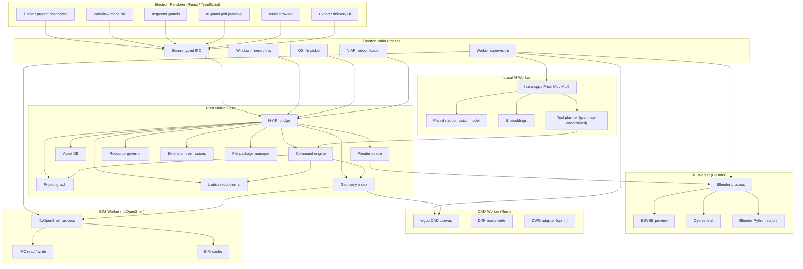

# AEC Studio — Architecture

---

## High-level architecture



---

## Recommended stack

| Layer | Technology | Reason |
|---|---|---|
| Desktop shell | Electron | Cross-platform desktop with mature native bridges |
| UI framework | React + TypeScript | Productivity UI, typed IPC, ecosystem |
| Core engine | Rust | Memory safety, performance, geometry indexing, command engine |
| Native viewport | wgpu | Cross-platform GPU (Vulkan / Metal / D3D12 / OpenGL) for 3D + 2D CAD |
| Local database | SQLite / SQLCipher | Local-first, encrypted, single-file project storage |
| Search / hybrid retrieval | SQLite FTS5 + embeddings | Asset search, BIM property search without external services |
| Model runtime | llama.cpp / PrismML sidecar | Local GGUF inference with broad acceleration coverage |
| Apple Silicon | MLX | macOS ARM inference acceleration |
| Render engine | Cycles + EEVEE via Blender worker | Photoreal final + fast preview, sandboxed worker |
| BIM / IFC | IfcOpenShell | Mature open-source IFC parsing, geometry, and conversion |
| Electron bridge | N-API (napi-rs) | Low-overhead Rust ↔ Node.js calls |
| Packaging | electron-builder | Platform installers for macOS and Windows |

---

## Why Rust

Rust is the primary systems language for AEC Studio's core engine. It handles:

- The project graph (spatial hierarchy, geometry, materials, schedules)
- The command engine with an undo/redo journal
- Geometry indexing (BVH, spatial queries, mesh cache)
- The render queue and Blender worker orchestration
- The asset database with content hashing (BLAKE3) and dedup
- Encrypted local storage (SQLite + SQLCipher)
- The resource governor and hardware profiler
- The export engine (PDF, DXF, IFC, glTF, proposal pack)
- The extension permissions enforcer
- The audit trail
- The N-API bridge to Electron and the cross-platform N-API addon

Rust-first matches the substrate patterns from [kennguy3n/knowledge](https://github.com/kennguy3n/knowledge) and [kennguy3n/Tessera](https://github.com/kennguy3n/Tessera), keeping the engine fast, predictable, and free of unsafe code (`unsafe_code = "forbid"` at the workspace level).

---

## Why wgpu

The viewport, 2D CAD canvas, and selection/overlay layers all run on **wgpu**:

- **Cross-platform** — Vulkan on Linux/Windows, Metal on macOS/iOS, D3D12 on Windows, OpenGL fallback.
- **Predictable** — explicit pipelines, no driver-specific surprises.
- **Shared across modes** — 3D Design and 2D CAD reuse the same renderer with different camera/projection setups.

### Viewport split

| Surface | wgpu role | Notes |
|---|---|---|
| 3D Design viewport | Forward + clustered renderer for design preview | Snap overlays, selection halos, gizmos |
| 2D CAD canvas | Orthographic projection, batched line/polyline/hatch | Pixel-perfect snapping, infinite zoom |
| Selection overlay | Stencil + outline pass | Shared across 3D and 2D |
| Hover / measure tools | Lightweight overlay pass | Read-only of the geometry index |
| Final render preview | Texture display | Just shows the Cycles/EEVEE output |

---

## Electron boundary

AEC Studio enforces a **strict security boundary** between the renderer and native capabilities.

```
React renderer → typed IPC → Electron main → N-API → Rust core → workers (Blender, IFC, AI, CAD)
```

### Anti-patterns to avoid

| Anti-pattern | Why it's dangerous |
|---|---|
| Renderer directly accessing files | Bypasses OS permission model |
| Renderer launching worker processes | Exposes process control to the web context |
| Renderer holding asset packs in memory | Memory bloat and exposes proprietary asset bytes |
| Renderer parsing IFC | Pulls a heavy native dependency into the renderer; security risk |
| Renderer talking to the AI sidecar directly | Bypasses the safety validator and audit trail |
| Renderer accessing the encrypted DB | Exposes the encryption key to the web context |

### TypeScript API interfaces

```typescript
interface ProjectApi {
  createFromTemplate(templateId: string, options?: ProjectCreateOptions): Promise<ProjectId>;
  open(packagePath: string): Promise<ProjectSummary>;
  save(projectId: ProjectId): Promise<void>;
  listRecents(): Promise<ProjectSummary[]>;
  exportPackage(projectId: ProjectId, target: ExportTarget): Promise<ExportResult>;
}

interface DesignApi {
  placeFurniture(req: PlaceFurnitureRequest): Promise<CommandResult>;
  paintMaterial(req: PaintMaterialRequest): Promise<CommandResult>;
  setLighting(req: SetLightingRequest): Promise<CommandResult>;
  saveCamera(req: SaveCameraRequest): Promise<CameraId>;
  listAssets(query: AssetQuery): Promise<AssetSummary[]>;
}

interface DraftApi {
  drawPrimitive(req: DrawPrimitiveRequest): Promise<CommandResult>;
  editTool(req: EditToolRequest): Promise<CommandResult>;
  createSheet(req: SheetCreateRequest): Promise<SheetId>;
  setLayerState(req: LayerStateRequest): Promise<CommandResult>;
  importDxf(filePath: string): Promise<ImportResult>;
  exportDxf(req: DxfExportRequest): Promise<ExportResult>;
}

interface BimApi {
  importIfc(filePath: string): Promise<ImportResult>;
  exportIfc(req: IfcExportRequest): Promise<ExportResult>;
  classify(req: ClassifyRequest): Promise<CommandResult>;
  setProperty(req: SetPropertyRequest): Promise<CommandResult>;
  generateSchedule(req: ScheduleRequest): Promise<ScheduleResult>;
  validate(req: ValidateRequest): Promise<ValidationReport>;
  diff(packageA: string, packageB: string): Promise<DiffReport>;
}

interface RenderApi {
  enqueueRender(req: RenderRequest): Promise<JobId>;
  listJobs(): Promise<RenderJobStatus[]>;
  cancelJob(jobId: JobId): Promise<void>;
  applyPreset(req: ApplyPresetRequest): Promise<CommandResult>;
  diagnose(req: DiagnoseRequest): Promise<DoctorReport>;
}

interface AiApi {
  listTools(scope: ModeScope): Promise<ToolSchema[]>;
  plan(req: PlanRequest): AsyncIterable<PlanChunk>;
  acceptDiff(diffId: string): Promise<CommandResult>;
  rejectDiff(diffId: string): Promise<void>;
  cancelJob(jobId: string): Promise<void>;
  runtimeStatus(): Promise<RuntimeStatus>;
}

interface ExportApi {
  exportPdf(req: PdfExportRequest): Promise<ExportResult>;
  exportDxf(req: DxfExportRequest): Promise<ExportResult>;
  exportIfc(req: IfcExportRequest): Promise<ExportResult>;
  exportGltf(req: GltfExportRequest): Promise<ExportResult>;
  buildProposalPack(req: ProposalPackRequest): Promise<ExportResult>;
}
```

---

## 9.1 Rust command engine

Every state mutation in AEC Studio is a **command**: a typed, serializable record applied through the command engine. AI actions reuse the same engine via the diff preview.

### Command structure

```json
{
  "command_id": "cmd_01HG5...",
  "ts": "2026-05-19T17:14:21Z",
  "scope": "design",
  "actor": { "kind": "user" },
  "tool": "design.place_furniture",
  "arguments": {
    "asset_id": "asset_sofa_modern_3seat_v2",
    "anchor": { "type": "room", "id": "space_living_room" },
    "offset_mm": { "x": 0, "y": 0, "z": 0 },
    "rotation_deg": 0,
    "scale": 1.0
  },
  "diff": {
    "diff_id": "diff_a1b2c3",
    "applied": [
      { "kind": "create", "entity_id": "furn_01HG5...", "entity_kind": "furniture_instance" }
    ]
  },
  "audit": {
    "hash": "blake3:...",
    "previous_hash": "blake3:...",
    "signed": false
  }
}
```

### Capabilities

- Each command declares its scope (`design`, `draft`, `bim`, `render`, `deliver`).
- Each command declares a bounded set of entities it can mutate.
- The undo/redo journal stores reversible deltas, not snapshots, for compact history.
- AI-emitted commands always carry `actor.kind = "ai"` and `actor.tool` for provenance.
- Commands are append-only in the audit log; the project graph is materialized by replaying commands or loading a checkpoint.

---

## 9.2 Blender worker

```
workers/blender/
├── aec_blender_worker.py       # Entrypoint, IPC over stdin/stdout JSON-lines
├── scene_loader.py             # Loads AEC project graph into a Blender scene
├── materials.py                # Translates PBR materials into Blender shaders
├── lighting.py                 # Sun/sky, area lights, IES profiles
├── eevee_preview.py            # EEVEE preview pipeline
├── cycles_final.py             # Cycles final render with denoise
├── walkthrough.py              # Camera path animation + stitch_frames() FFmpeg MP4 encode (graceful fallback to image sequence)
├── panorama.py                 # Equirectangular panorama renders
└── manifest.json               # Pinned Blender version range
```

### Worker types

| Worker | Trigger | Engine | Out |
|---|---|---|---|
| Preview | Viewport refresh / camera change | EEVEE | RGB texture |
| Final | User-initiated render | Cycles | PNG / EXR + denoise |
| Batch | Render queue | Cycles | Multi-image pack |
| Walkthrough | User-initiated | Cycles | MP4 / image sequence |
| Panorama | User-initiated | Cycles equirectangular | EXR / JPG |

**Key decision:** Blender is **never linked** into AEC Studio's process. It is invoked as an external worker process and communicates over JSON-line IPC. This keeps AEC Studio's GPL exposure scoped to the AGPL-3.0 license already declared, and lets users swap Blender versions without rebuilding the core.

---

## 9.3 2D CAD worker

```
crates/aec_cad/
├── primitives/                 # Line, polyline, arc, circle, ellipse, spline, hatch, text
├── editing/                    # Move, copy, rotate, scale, mirror, offset, trim, extend
├── precision/                  # Snaps, grid, ortho, polar, tracking, constraints
├── layers/                     # Layer state, freeze/thaw, lineweight, linetype
├── blocks/                     # Library blocks, dynamic blocks, attributes
├── dims/                       # Linear, angular, radial, baseline, continue
├── sheets/                     # Title blocks, viewports, sheet sets
├── command_line/               # Keyboard-first command parser
├── dxf/                        # DXF read/write
└── dwg_adapter/                # Optional DWG adapter (out-of-process)
```

### Performance design

- All primitives and edits flow through the same command engine as the Design module.
- The 2D CAD canvas uses wgpu with an orthographic camera; rendering is batched per layer.
- Snapping precomputes a spatial index for end/mid/center/intersection/perpendicular/tangent snaps.
- Constraints are solved incrementally; the solver runs in a worker thread.
- DXF is the canonical format; DWG is a separate adapter that is not loaded by default.

---

## 9.4 BIM / IFC worker

```
workers/ifc/
├── aec_ifc_worker.py           # Entrypoint; wraps IfcOpenShell Python API
├── import_pipeline.py          # IFC → AEC project graph (parametric where possible)
├── export_pipeline.py          # AEC project graph → IFC with GUID preservation
├── classifier.py               # AI-assisted classification adapter
├── property_editor.py          # Pset/Qto editing
├── schedules.py                # Room / door / window / material schedules
├── validator.py                # Strict validation against schema and project rules
├── diff.py                     # IFC diff at element + property level
└── manifest.json               # Pinned IfcOpenShell version (v0.8.0)
```

### BIM cache strategy

```
IFC file → IfcOpenShell parse → AEC project graph delta →
  ├── Persist deltas as commands in the command engine
  ├── Store a per-element BIM cache (geometry hash, Pset hash, classification)
  └── Materialize fast IFC re-export from cache (skip re-tessellation when unchanged)
```

The BIM cache lets large IFC models open in seconds on re-open and lets export skip unchanged geometry.

---

## 9.5 Render worker

```
crates/aec_render/
├── benches/eevee_latency.rs    # Criterion benchmark for Rust-side IPC overhead (250ms budget)
├── blender_discovery.rs        # Cross-platform Blender binary discovery (env → known paths → PATH)
├── cameras.rs                  # CameraSnapshot, CameraStore, CameraJournal, preset thumbnails
├── cycles.rs                   # Cycles final-render pipeline
├── doctor.rs                   # Material check / diagnostics (missing texture, non-PBR, swapped channels)
├── eevee.rs                    # EEVEE preview pipeline
├── history.rs                  # RenderHistory + compare(a, b) → CompareResult
├── job.rs                      # RenderJob, RenderJobStatus, walkthrough frame tracking, resume state
├── lighting.rs                 # Lighting presets (WarmEvening/Daylight/Studio/...), IES profiles
├── preset.rs                   # Quick / Standard / High / Studio / EEVEE Preview / Walkthrough / Panorama + recommend_preset(tier)
├── queue.rs                    # Render queue (single, batch, matrix); resume on failure; governor-bounded concurrency
├── scene.rs                    # RenderScene, RenderCamera, RenderLight serialization
└── worker.rs                   # JSON-line IPC to the Blender worker; StitchWalkthrough request + WalkthroughOutput enum
```

---

## 9.6 KChat integration

KChat integration is the **only** optional cross-organisation surface in AEC Studio. It is gated on two axes:

1. **Compile-time** by the `kchat` cargo feature on `aec_core` (default-enabled). Disabling default features strips the `kchat`, `kchat_config`, and `kchat_sync` modules and their re-exports from the compiled crate; the `ActorKind::KChat` enum variant stays unconditional so the audit-log type remains stable across feature configurations.
2. **Runtime** by the `KChatConfig::enabled` toggle exposed in Settings. When the config is disabled, every publish/sync method returns `KChatError::KChatDisabled` and the corresponding UI elements hide themselves.

```
crates/aec_core/
├── kchat.rs                    # KChatArtifact (incl. AssetPack variant), ArtifactCard, KChatPublisher
│                               # trait, InMemoryPublisher (tests), ReviewComment / ApprovalStatus /
│                               # ReviewCard, AssetPackReference + AssetPackManifest::artifact_card
├── kchat_sync.rs               # One-way comment sync (KChat thread → audit trail) with dedup by
│                               # (thread_id, timestamp, commenter) so re-imports are no-ops
└── kchat_config.rs             # Local-first config (enabled: bool, default_thread_id: Option<String>);
                                # `KChatIntegration` gates every operation on `enabled`. Its
                                # `publish_asset_pack` routes the manifest *through* the transport as
                                # an asset-pack ArtifactCard and returns `AssetPackPublishOutcome`
                                # (reference + PublishResult).
```

```
apps/desktop/renderer/src/components/kchat/
├── PublishCardModal.tsx        # Preview an ArtifactCard before publishing
└── ArtifactCardPreview.tsx     # Image + caption + metadata preview tile
```

### Data flow

```
┌──────────────────────────────┐
│  AEC Studio (local-first)    │
│                              │
│  ┌────────┐    ┌──────────┐  │           ┌─────────────────┐
│  │ Render │───▶│ Artifact │──┼──publish──▶│  KChat thread   │
│  │  Sheet │    │   Card   │  │  (one-way) │  (user owned)   │
│  └────────┘    └──────────┘  │           └────────┬────────┘
│                              │                    │ inline comments
│  ┌──────────────────────┐    │                    ▼
│  │ AuditEntry           │◀───┼──ingest_review─── ReviewComment
│  │  actor.kind=KChat    │    │  (kchat_sync.rs, dedup'd)
│  └──────────────────────┘    │
└──────────────────────────────┘
```

- **Outbound only.** Project data never leaves AEC Studio except through an explicit publish. `KChatPublisher` is a trait; the user supplies the transport (HTTP, IPC, file drop) — there is no centralised AEC Studio service.
- **Inbound is comments only.** `kchat_sync.rs` imports `ReviewComment`s and turns them into `AuditEntry` rows with `ActorKind::KChat`. No project blobs are downloaded; team asset packs use the user's own transport for blobs and only sync manifest hashes.
- **Local-first guarantee.** Tests in `crates/aec_core/src/kchat_config.rs` confirm that a disabled config rejects every publish/sync method. The Settings page exposes the toggle so users can keep AEC Studio entirely offline.

---

### Camera and render state

- `CameraSnapshot` captures position, target, up, focal length (mm), sensor size, exposure (EV),
  white balance (K), depth of field (f-stop + focus distance), and aspect ratio.
- `CameraStore` is the source of truth for saved cameras; every mutation flows through
  `CameraJournal`, which folds into the global command engine for undo/redo.
- Thumbnails are rendered deterministically (32×32 RGBA8) from the snapshot so the camera tile
  grid is reproducible across machines.
- Camera presets (`InteriorCloseUp`, `Wide`, `EyeLevel`, `BirdsEye`) configure focal/sensor/DoF
  parameters; render presets configure the engine (EEVEE/Cycles), sample count, and resolution.

---

## 10.1 Resource governor

```
crates/aec_governor/
├── profiler/                   # Hardware profile (CPU, RAM, GPU, OS, accelerators)
├── policy/                     # Tier policies (low / medium / high / pro)
├── scheduler/                  # Render queue, AI queue, worker rate-limiting
├── thermal/                    # Backs off under sustained CPU/GPU load
├── memory/                     # Pressure-aware mesh / cache eviction
└── ui_report/                  # Surfaces governor state to the status bar
```

### What the governor controls

- Render preset and sample count.
- Number of concurrent Cycles tiles.
- AI model tier (Bonsai 1.7B / 4B / 8B).
- Whether EEVEE preview runs at full or half resolution.
- Whether the 3D viewport runs at native or downscaled framebuffer under heavy load.
- Eviction policy for the geometry mesh cache.
- Maximum simultaneous render jobs (1 by default on low-tier hardware).
- Background AI tasks while a render is running (paused by default).

---

## 10.2 Hardware profiles

| Profile | CPU | RAM | GPU | Default model tier | Default render preset |
|---|---|---|---|---|---|
| **Low** | Dual-core / 4-thread x86 or older M1 | 4–6 GB | None / integrated | Bonsai 1.7B Q4_K_M | EEVEE preview only, Cycles "Quick" |
| **Medium** | Modern 6-core x86 or M2 | 8–12 GB | Integrated or low-end discrete | Bonsai 1.7B / 4B | Cycles "Standard" |
| **High** | 8+ cores or M2 Pro / M3 | 16–32 GB | RTX 3060 / Apple GPU 10-core+ | Bonsai 4B | Cycles "High" |
| **Pro** | 12+ cores / Threadripper / M3 Max | 32+ GB | RTX 4070+ or Apple GPU 30-core+ | Bonsai 8B | Cycles "Studio" |

The profile is detected at first run and re-evaluated when the user changes the runtime configuration. Users can override the recommended tier but the governor logs and surfaces the override.

---

## 10.3 Scene complexity budgets

| Scene type | Triangle budget | Asset instances | Lights | Notes |
|---|---|---|---|---|
| Single room | 0.5 M | 50–100 | 4–8 | Apartment / kitchen / bathroom |
| Full apartment | 2 M | 200–500 | 12–24 | Multi-room |
| Café / retail fit-out | 3 M | 500–1500 | 16–32 | Customer + back-of-house |
| Office floor | 5 M | 2000+ | 32–64 | Open plan + meeting rooms |
| Villa | 8 M | 3000+ | 48+ | Multi-storey |

Budgets are advisory — exceeding them triggers governor warnings and LOD swap-ins.

---

## 10.4 Viewport optimization

| Concern | Strategy |
|---|---|
| Mesh count | Per-asset LOD chain (LOD0 hero, LOD1 mid, LOD2 silhouette) |
| Draw call count | Per-layer batching in wgpu, instanced draws for furniture |
| Texture memory | Streaming texture atlas, lazy load per visible asset |
| Snapping cost | Precomputed snap index per element, refreshed on edit |
| Selection overhead | Stencil-based outline; no per-vertex CPU work |
| Idle GPU usage | Frame coalescing: viewport idles at 0 fps when nothing changes |
| Pan/zoom | Camera-space culling + frustum cull + occlusion query (where supported) |
| Hover queries | Spatial BVH built once per geometry-edit transaction |

---

## 10.5 Render optimization

### Render routing

```
User clicks "Render"
  │
  ├── If preview → EEVEE worker (fast, denoise-less)
  ├── If final / batch / walkthrough → Cycles worker
  │     │
  │     ├── Choose tile size from governor
  │     ├── Choose sample count from preset
  │     ├── Enable denoiser (OIDN / OptiX) per hardware
  │     └── Stream tiles back to the render queue
  └── Resume on failure via persisted job state
```

### Render job optimization

| Concern | Strategy |
|---|---|
| Cold-start | Reuse the Blender worker across jobs (warm scene loader) |
| Mesh re-translation | Cache Blender scene per project, invalidate by geometry hash |
| Sample budget | Per-preset minimum samples, denoise pass closes the rest |
| Multi-job throughput | Cycles concurrency capped to N tiles by the governor |
| Crash isolation | Worker crash never crashes AEC Studio; job marked failed and resumable |
| Walkthrough | Frame-by-frame resume from the last completed frame |

### User-facing render presets

| Preset | Engine | Samples | Denoise | Resolution scale | Notes |
|---|---|---|---|---|---|
| Quick | Cycles | 32 | OIDN | 0.75× | Fast looks |
| Standard | Cycles | 128 | OIDN | 1.0× | Daily delivery |
| High | Cycles | 256 | OIDN | 1.0× | Client hero |
| Studio | Cycles | 1024 | OIDN | 1.0× | Print-quality |
| EEVEE Preview | EEVEE | n/a | — | 0.5–1.0× | Real-time-ish viewport |
| Walkthrough | Cycles | 64 / frame | OIDN | 1.0× | Multi-frame |
| Panorama | Cycles (equi) | 128 | OIDN | 1.0× | 360° room shots |

---

## 10.6 Asset optimization

### Pipeline

```
Asset import (glTF / FBX / OBJ)
  ├── Validate license + manifest
  ├── Normalize transform + units
  ├── Compute LOD chain (LOD0 hero, LOD1 mid, LOD2 silhouette)
  ├── Generate thumbnail (EEVEE quick render)
  ├── Hash mesh + materials (BLAKE3) for dedup
  └── Persist to the asset DB (SQLite + content-addressed blob store)
```

### Asset metadata

```json
{
  "asset_id": "asset_sofa_modern_3seat_v2",
  "name": "Modern 3-seat sofa",
  "license": "CC-BY-4.0",
  "attribution": "Studio AEC, 2026",
  "tags": ["sofa", "living", "modern", "fabric"],
  "style_tags": ["Scandinavian", "Japandi"],
  "lods": [
    { "level": 0, "tri_count": 24800, "blob_hash": "blake3:..." },
    { "level": 1, "tri_count":  6200, "blob_hash": "blake3:..." },
    { "level": 2, "tri_count":  1400, "blob_hash": "blake3:..." }
  ],
  "materials": [
    { "name": "Body fabric",   "pbr_hash": "blake3:..." },
    { "name": "Wood legs",     "pbr_hash": "blake3:..." }
  ],
  "thumbnail_blob": "blake3:...",
  "vendor": "studio-aec",
  "version": "2"
}
```

---

## 10.7 CAD optimization

| Concern | Strategy |
|---|---|
| Large drawings (100 k+ entities) | Spatial index (R-tree) per layer, viewport-clipped rendering |
| Live edit responsiveness | Constraint solver runs incrementally on background thread |
| Hatch fill cost | Pre-tessellated hatch cache invalidated only on boundary edits |
| Block instancing | One geometry blob + many transforms (GPU instancing) |
| DXF import | Streaming parser; entities materialized as they parse |
| Dim style recompute | Cached per dim style; only re-render dims that changed |
| Sheet plot | Background render thread, deterministic PDF output |
| Command line responsiveness | All commands are pure functions over the command engine |

---

## 10.8 BIM / IFC optimization

| Concern | Strategy |
|---|---|
| Large IFC parse | IfcOpenShell streaming iterator; materialize geometry lazily |
| Re-import speed | BIM cache keyed by element GUID + geometry hash |
| Pset edit cost | Element-level Pset diff, write-back only on save |
| Schedule generation | Indexed property store; schedule queries hit SQLite directly |
| Diff between models | Hash-based element diff + property diff (no full re-parse) |
| Validation | Rule-based engine + opt-in MVD; runs on background thread |
| Roundtrip | Preserve unknown Psets verbatim; never silently drop attributes |

---

## 10.9 Local AI optimization

| Concern | Strategy |
|---|---|
| Cold start | Reuse the llama.cpp / PrismML sidecar across requests (60 s idle-unload) |
| Memory | Model tier matched to the hardware profile |
| Throughput | `--parallel 2` shared sidecar, per-request cancellation |
| Latency | Grammar-constrained decoding emits only valid tool-call tokens |
| Quality | Bonsai 1.7B for simple tools; auto-upgrade to 4B/8B for planning |
| Power | Mac thermal back-off; Windows GPU split between viewport and inference |
| Determinism | Fixed seeds and deterministic samplers when reproducibility is required |
| Safety | All outputs pass through the safety validator before any commit |

---

## Local model runtime

### PrismML llama.cpp fork

AEC Studio uses the **PrismML** fork of llama.cpp ([kennguy3n/llama.cpp@prism](https://github.com/kennguy3n/llama.cpp)) for local model inference. The PrismML fork adds:

- Q1_0_g128 ternary repack format for memory-efficient small models.
- Acceleration across CUDA, Metal, Vulkan, AVX-512 VNNI, AVX-VNNI, AVX2, and ARM NEON.
- Tooling and packaging hooks AEC Studio uses to produce per-platform sidecars.

### Adapter bootstrap priority

```
MLXAdapter (macOS Apple Silicon) → LlamaCppAdapter (Windows / Linux / fallback) → Disabled (no AI mode)
```

### Inference tasks for AEC

| Task | Mode | Notes |
|---|---|---|
| Plan detection | Design | Vision model; outputs wall polylines |
| Style assistant | Design | Text + light vision; outputs furniture set + lighting tweak |
| Layout suggestion | Design | Text + spatial features; outputs alternate furniture layouts |
| Render doctor | Render | Vision; outputs preset and lighting suggestions |
| CAD cleanup | Draft | Tool-call planner over the 2D primitives |
| Plan-to-wall | Draft | Vision; outputs polylines for parametric walls |
| Schedule fill | Draft / BIM | Text; outputs Pset values |
| Classification | BIM | Vision + text; outputs IfcClass per element |
| Property fill | BIM | Text; outputs Pset/Qto values |
| Validation help | BIM | Text; outputs suggested fixes |
| Cover-page draft | Deliver | Text; writes a short concept paragraph |

### Shared sidecar pattern

Single `llama-server` (PrismML) process per session with:

- `--parallel 2` for two concurrent requests.
- `mmap` for fast model load.
- 60-second idle unload to reclaim memory.
- Per-request cancellation through the AI panel and command bar.

### Grammar-constrained decoding

All tool-call outputs are constrained with **GBNF** grammars in `crates/aec_ai/grammars/`. This ensures the planner cannot emit malformed JSON or unknown tool names. The safety validator then enforces scope and bounded changes before any preview diff is constructed.

### Device tiering

| Tier | Available RAM | Capability |
|---|---|---|
| **Low** | 4–6 GB | Bonsai 1.7B Q4_K_M only, no concurrent AI + render |
| **Medium** | 8–12 GB | Bonsai 1.7B / 4B, AI + EEVEE preview concurrently |
| **High** | 16–32 GB | Bonsai 4B always-on, AI + Cycles concurrent (with governor) |
| **Pro** | 32+ GB | Bonsai 8B always-on, multi-job AI + render |

---

## Project file structure

A project is a directory package with a `.aecstudio` extension. It is portable, content-addressed where possible, and safe to put under user-level sync (Dropbox, OneDrive, etc.).

```
project.aecstudio/
├── manifest.json               # Project id, schema version, units, region, standards
├── project.sqlite              # SQLCipher-encrypted project DB
├── commands/                   # Append-only command log (one file per day)
│   ├── 2026-05-19.jsonl
│   └── 2026-05-20.jsonl
├── checkpoints/                # Snapshots for fast load and rollback
│   ├── 2026-05-19T12-00.snap
│   └── 2026-05-20T09-00.snap
├── geometry/                   # Content-addressed mesh blobs
├── materials/                  # PBR material packs used by this project
├── assets/                     # Asset references (manifests) — actual blobs live in the asset DB
├── sheets/                     # 2D CAD sheet definitions
├── bim/                        # IFC import cache and pset overrides
├── renders/                    # Render queue state + finished image outputs
├── revisions/                  # Tagged revision snapshots
├── audit/                      # Append-only audit log (signed hash chain)
├── ai/                         # AI action log + accepted/rejected diffs
└── exports/                    # Last-known exports (PDF, DXF, IFC, glTF, packs)
```

### 8.1 Local database

The encrypted `project.sqlite` stores:

- The project graph as fast-lookup tables (entities, components, relations).
- Indexed properties for schedules and BOQ queries.
- The asset reference table (per-project — blobs live in the user-level asset DB).
- The undo journal head and last applied command id.
- Per-element BIM cache hashes.
- Audit and AI action metadata (full log bodies are append-only on disk in `audit/` and `ai/`).

Encryption uses SQLCipher with **AES-256 page-level** and per-project keys. Content hashing across the package uses **BLAKE3**. Per-scope DEKs follow the same cryptographic-forgetting pattern as [kennguy3n/knowledge](https://github.com/kennguy3n/knowledge): deleting the scope key permanently invalidates the data.

---

## Platform-specific notes

### macOS

| Component | Detail |
|---|---|
| Shell | Electron + React |
| Native addon | Universal N-API addon (Intel + Apple Silicon) |
| Preferred AI runtime | MLX (MLXAdapter) |
| Render GPU | Metal (Cycles + EEVEE), wgpu Metal backend |
| Fallback AI runtime | LlamaCppAdapter (CPU AVX2/AVX-VNNI on Intel; CPU NEON on Apple Silicon) |
| Packaging | electron-builder, `.dmg` and `.zip` |
| Code signing / notarization | Apple Developer ID + notarytool |

### Windows

| Component | Detail |
|---|---|
| Shell | Electron + React |
| Native addon | C++ N-API addon |
| AI runtime | LlamaCppAdapter |
| CPU-only | AVX2 minimum, AVX-VNNI / AVX-512 VNNI when available |
| CPU+GPU | Vulkan / CUDA backend for inference; Cycles GPU CUDA/OptiX |
| Render GPU | wgpu D3D12 (default) or Vulkan |
| Packaging | electron-builder, `.exe` (NSIS) and `.msi` |
| Code signing | EV code-signing cert via Authenticode |

### Linux

| Component | Detail |
|---|---|
| Shell | Electron + React |
| Native addon | N-API addon (x86_64) |
| AI runtime | LlamaCppAdapter |
| CPU-only | AVX2 minimum, AVX-VNNI / AVX-512 VNNI when available (surfaced by `aec_governor::profiler`) |
| CPU+GPU | Vulkan for inference; Cycles GPU via Vulkan or CUDA on NVIDIA |
| Render GPU | wgpu Vulkan backend |
| GPU detection | `/proc/driver/nvidia/version` → `lspci -mm` → `vulkaninfo --summary` (best-effort cascade) |
| Blender discovery | `AEC_BLENDER_BIN` / `BLENDER_BIN` → known install paths (`/usr/bin`, `/usr/local/bin`, `/snap/bin`, Flatpak, `~/.local/bin`) → `PATH` |
| Packaging | electron-builder, AppImage + `.deb`, optional Snap (`packaging/linux/`) |
| Desktop integration | `.desktop` file with `application/x-aec` MIME and `x-scheme-handler/aec` deep-link handler |

### Device tiering

| Tier | Available RAM | Capability |
|---|---|---|
| **Low** | 4–6 GB | Bonsai 1.7B Q4_K_M only, EEVEE preview, single render job |
| **Medium** | 8–12 GB | Bonsai 1.7B / 4B, Cycles "Standard" |
| **High** | 16–32 GB | Bonsai 4B always-on, Cycles "High" with GPU denoise |
| **Pro** | 32+ GB | Bonsai 8B always-on, Cycles "Studio", multi-job render queue |

---

## Security and privacy

| Principle | Implementation |
|---|---|
| Local-first storage | Project graph, assets, models, and renders live on the user's machine |
| Explicit network use | No telemetry; sync and KChat publish are explicit user actions |
| Encrypted project DB | SQLCipher with AES-256 page-level encryption and per-project keys |
| BLAKE3 content hashing | Used across geometry blobs, assets, audit log, command journal |
| Safe renderer | No direct file, worker, or model access from the renderer |
| Secure IPC | Typed and validated messages between renderer, main, and Rust core |
| Process separation | Renderer / main / Rust core / Blender / IFC / AI sidecar are separate processes |
| Worker sandboxing | Workers run with reduced privileges and explicit project-scoped file access |
| AI safety | Strict tool schema, grammar-constrained decoding, safety validator, preview diffs |
| Audit log | All commands, AI actions, exports, and connector events are logged |
| Cryptographic forgetting | Per-scope DEKs; deleting a key permanently invalidates the scope |
| Extension sandbox | Extensions declare permissions up front; the loader enforces them |

---

## Repository layout

```
aec-studio/
├── apps/
│   └── desktop/
│       ├── electron/           # Electron main process (main.ts, preload.ts, ipc.ts)
│       └── renderer/           # React / TypeScript UI (pages, components, hooks, styles)
├── crates/                     # Rust core engine
│   ├── aec_core/               # Core types, config, errors, project graph,
│   │                             revision/version_diff, KChat (kchat.rs, kchat_sync.rs, kchat_config.rs)
│   ├── aec_bridge/             # N-API bridge for Electron
│   ├── aec_command/            # Command engine, undo/redo journal
│   ├── aec_geometry/           # Geometry index, spatial queries, mesh cache
│   ├── aec_viewport/           # wgpu viewport, 2D CAD canvas, selection overlays, reference_image.rs
│   ├── aec_cad/                # 2D CAD: primitives, layers, blocks, snaps, dims
│   ├── aec_bim/                # BIM/IFC: IfcOpenShell adapter, spatial hierarchy
│   ├── aec_render/             # Render queue, Blender/Cycles worker orchestration,
│   │                             EEVEE latency benchmark (benches/eevee_latency.rs)
│   ├── aec_assets/             # Asset database, import pipeline, LOD, thumbnails
│   ├── aec_materials/          # PBR material library, texture management, mood_board.rs
│   ├── aec_ai/                 # AI command planner, tool schema, safety validator,
│   │                             layout_suggestion.rs, cover_draft.rs, lighting_balance.rs,
│   │                             schedule_fill.rs, validation_help.rs
│   ├── aec_governor/           # Resource governor, hardware profiler, scheduling,
│   │                             Linux soak test (tests/linux_soak.rs)
│   ├── aec_export/             # PDF, DXF, IFC, glTF, proposal pack export;
│   │                             boq.rs, interior_pack.rs, contractor_pack.rs, bim_pack.rs,
│   │                             before_after.rs, xlsx.rs; determinism + contractor_perf + phase6_e2e tests
│   └── aec_audit/              # Audit trail, project history (ActorKind::KChat for review comments)
├── workers/                    # Native worker processes
│   ├── blender/                # Blender worker scripts (Python)
│   ├── ifc/                    # IfcOpenShell worker
│   └── ai/                     # llama-server sidecar config
├── templates/                  # Project, room, drawing, render, BIM templates
│   ├── interior/
│   ├── architecture/
│   └── drafting/
├── assets/                     # Bundled asset packs
│   ├── furniture/
│   ├── materials/
│   └── presets/
├── packaging/                  # electron-builder configs
│   ├── linux/                  # AppImage, .deb, .snap + .desktop
│   ├── macos/
│   └── windows/
├── docs/                       # Additional documentation
├── .github/workflows/          # CI configuration
├── LICENSE                     # AGPL-3.0
├── README.md
├── CONTRIBUTING.md
├── SECURITY.md
├── PROPOSAL.md
├── ARCHITECTURE.md
└── PROGRESS.md
```

---

## Design system

AEC Studio's UI follows the **KChat design system** (same tokens as [kennguy3n/Tessera](https://github.com/kennguy3n/Tessera)).

| Token | Value |
|---|---|
| **Primary accent** | `#7C3AED` (Purple/Violet) — headlines, CTA buttons, active states, links, icons |
| **Primary hover** | `#6D28D9` (darker violet) |
| **Background – page** | `#FFFFFF` (white) |
| **Background – card/surface** | `#F5F3FF` (light lavender) or `#F9FAFB` (light gray) |
| **Text – headline** | `#111827` (near-black) |
| **Text – body** | `#4B5563` (dark gray) |
| **Text – secondary** | `#6B7280` (medium gray) |
| **Font family** | `Inter` (primary), system sans-serif fallback stack: `-apple-system, BlinkMacSystemFont, "Segoe UI", Roboto, Helvetica, Arial, sans-serif` |
| **Primary button** | Solid `#7C3AED` background, white text, pill/rounded shape (`border-radius: 9999px`) |
| **Secondary button** | Outlined with `#111827` border, dark text, uppercase tracking |
| **Cards** | White `#FFFFFF` background, `border-radius: 12px`, subtle shadow `0 1px 3px rgba(0,0,0,0.1)` |
| **Overall feel** | Clean, modern, minimal — purple dominant against white/light surfaces |

---

## Links

- [README.md](README.md) — project overview
- [PROPOSAL.md](PROPOSAL.md) — product proposal
- [PROGRESS.md](PROGRESS.md) — phased delivery tracker
- [PHASES.md](PHASES.md) — top-line phase status
- [EXTENSIONS.md](EXTENSIONS.md) — extension system: manifest schema, permissions, signatures
- [CONTRIBUTING.md](CONTRIBUTING.md) — contribution guide
- [SECURITY.md](SECURITY.md) — security policy
- [kennguy3n/llama.cpp@prism](https://github.com/kennguy3n/llama.cpp) — local AI inference
- [kennguy3n/IfcOpenShell](https://github.com/kennguy3n/IfcOpenShell) — BIM/IFC engine
- [kennguy3n/cycles](https://github.com/kennguy3n/cycles) — path-traced renderer
- [kennguy3n/knowledge](https://github.com/kennguy3n/knowledge) — local knowledge substrate
- [kennguy3n/Tessera](https://github.com/kennguy3n/Tessera) — reference desktop architecture
